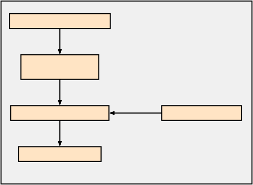
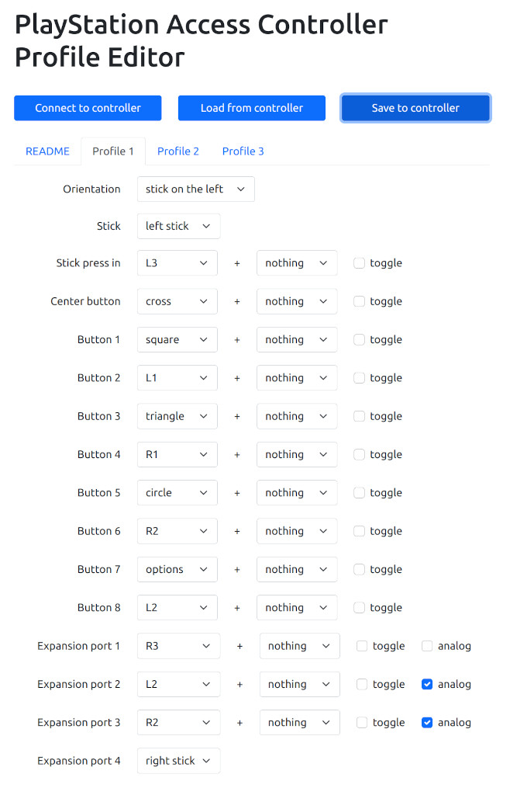
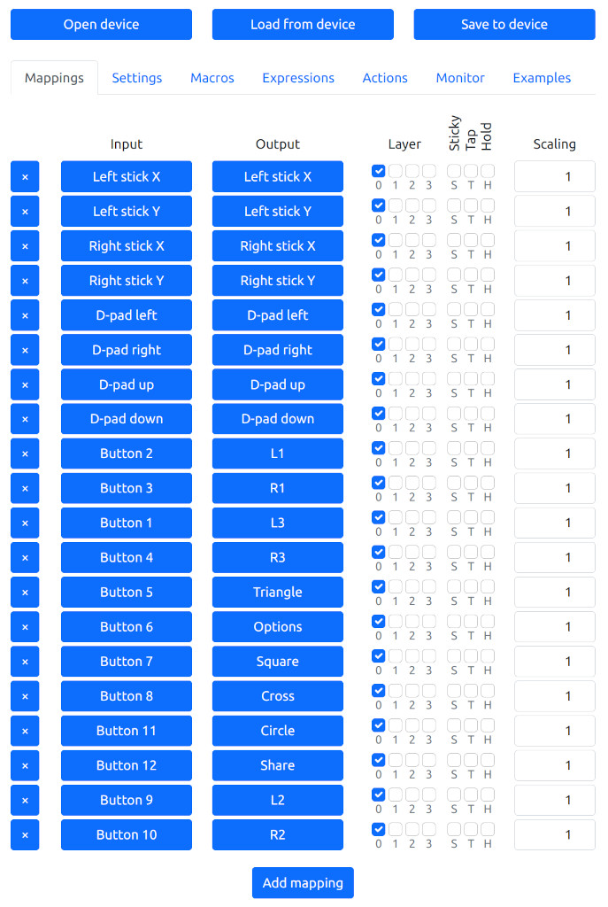
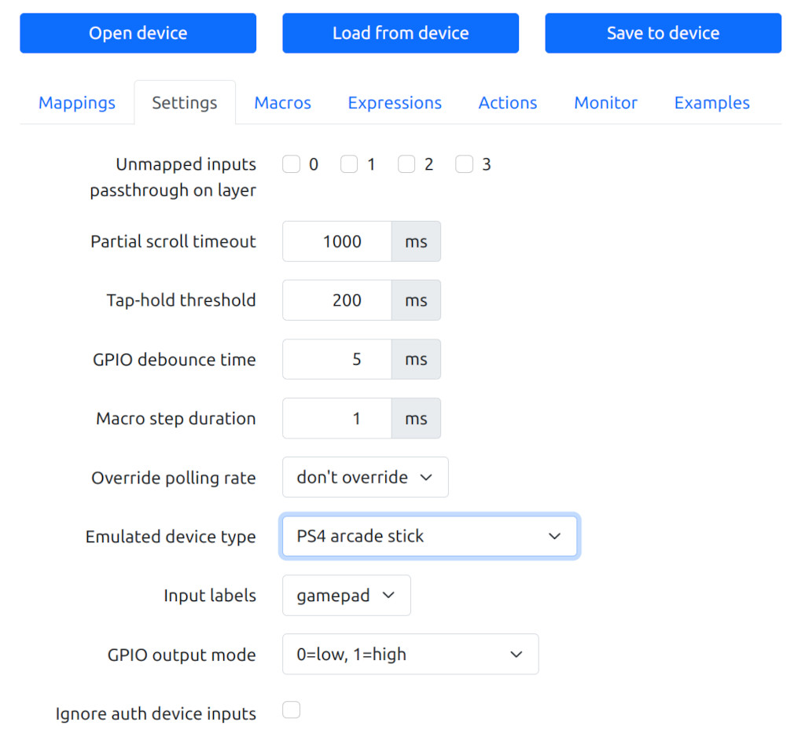

# Sony Access Controller for PlayStation 4

The Sony Access Controller (SAC) for PlayStation 5 consoles works well on the
PlayStation 5 console. The SAC comes with a variety of different joystick
toppers and button shapes and four input jacks for external buttons and
joysticks. Since Sony makes the PlayStation 4 console (PS4) and the SAC, they
could add support for SAC to the PS4 System Software. There is no indication
when this will happen.

The MayFlash Magic-S adapter supports many other controllers including the Xbox
Adaptive Controller and Sony DualSense Controller. But the adapter does not
support the SAC yet. MayFlash Support stated they will add support for the Sony
Access Controller to the Magic-S adapters.

This project use hid-remapper and MayFlash adapter to make the Sony Access
Controller work on the PlayStation 4 console.

<kbd></kbd>

The PS4 does not have an assist or co-pilot mode but a DualShock 4 controller
can be paired with the MayFlash adapter. The MayFlash adapter combines SAC
and DualShock 4 inputs so they control player 1.

Make sure the MayFlash LED is dark blue for PlayStation 4.

Press the SAC PlayStation logo button to make the PlayStation 4 recognize the
SAC.

## Hardware

* Sony Access Controller (SAC)
* Adafruit Feather RP2040 with USB Type A Host
* Snap-on Enclosure for Adafruit Feather RP2040 USB Host
* MayFlash Magic-S Pro adapter

### Prepare the SAC

To configure the SAC, use a PlayStation 5 or open [this web
site](https://www.jfedor.org/ps-access/) in Chrome.

When shipped from the factory, most of the SAC buttons do not work so this is
required to use all buttons and input jacks.

Changing the button mapping here requires changing the HID remapper button
mapping to match.

<kbd></kbd>

### Prepare the HID remapper board

Download this file [remapper_feather.uf2](https://github.com/jfedor2/hid-remapper/releases/latest/download/remapper_feather.uf2).

To install firmware on the Adafruit Feather RP2040 USB host board, press and
hold the Boot button. Press and release the Reset button. Release the Boot
button. A USB drive named "RPI-RP2" should appear. Drag and drop
remapper_feather.uf2 on the RPI-RP2 drive. After a few seconds the drive will
disappear. The board is ready.

Next configure the HID remapper board.

Open [this web site](https://www.jfedor.org/hid-remapper-config/) in Chrome.

* Click on the "Open device" button.
* Click on the "Actions" button.
* Click on the 'Import JSON" button.
* Select sac_ps4.json
* Save to device

After importing the JSON file the Mapping and Settings screens will look
like this.

<kbd></kbd>

<kbd></kbd>

For more information about changing the button mapping see
[How to use the configuration tool](https://github.com/jfedor2/hid-remapper#how-to-use-the-configuration-tool).

### Prepare the MayFlash Magic-S Pro adapter

Upgrade the firmware to the [newest version](https://www.mayflash.com/FAQ/3.html).

The adapter LED should be dark blue when plugged into a PlayStation 4. If not,
long press the adapter button until the LED changes to dark blue.
